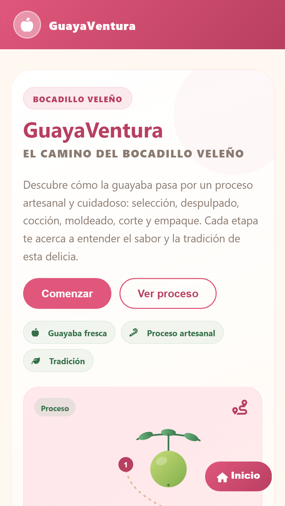
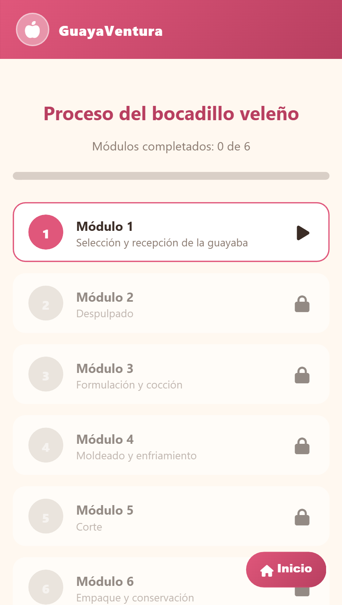
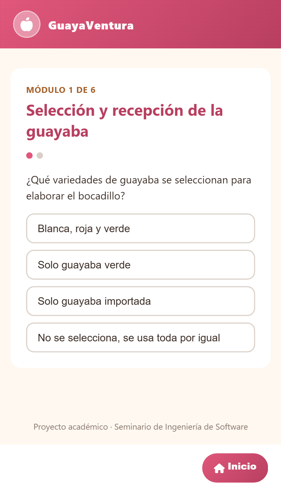

# 🍬 GuayaVentura

**El camino del bocadillo veleño** — un juego web para aprender, paso a paso, cómo se elabora el bocadillo veleño (dulce tradicional de guayaba de la región de Vélez, Santander).


Proyecto académico del Seminario de Actualización, docente Jeison Mauricio Delgado González. Desarrollado por [Nombre completo estudiante 1] y [Nombre completo estudiante 2].

## Capturas

<p align="center">
  
  
  
</p>

## Cómo se juega

El proceso del bocadillo se divide en 6 módulos, uno por cada etapa real de producción. Cada módulo se desbloquea al superar el anterior:

1. Lee la breve explicación de la etapa.
2. Responde 2 preguntas (de sí/no o de opción múltiple).
3. Si aciertas, avanzas. Si fallas, recibes una pista y puedes volver a intentarlo — no hay forma de "perder".
4. Al completar los 6 módulos se muestra un resumen de todo el proceso.

### Módulos

| # | Etapa |
|---|---|
| 1 | Selección y recepción de la guayaba |
| 2 | Despulpado |
| 3 | Formulación y cocción |
| 4 | Moldeado y enfriamiento |
| 5 | Corte |
| 6 | Empaque y conservación |

## Tecnologías

HTML, CSS y JavaScript sin frameworks, sin backend y sin dependencias externas (la única carga remota es la fuente de íconos Font Awesome vía CDN). Toda la aplicación corre en el navegador; el progreso se guarda en memoria durante la sesión de juego.

## Estructura del proyecto

```
├── index.html
├── style.css
├── script.js
└── assets/
    └── capturas de pantalla
```

## Ejecutarlo localmente

No requiere instalación. Basta con clonar el repositorio y abrir `index.html` en el navegador:

```bash
git clone https://github.com/Elpanchez/GuayaVentura.git
cd GuayaVentura
open index.html   # en Windows: start index.html
```

## Jugarlo en línea (GitHub Pages)

Este repositorio está publicado con GitHub Pages en:

`https://elpanchez.github.io/GuayaVentura/`

*(Configuración: Settings → Pages → Source: rama `main`, carpeta `/root`.)*

## Créditos

Basado en el modelo de propuesta de gamificación presentado en clase (Fedecacao), adaptado al proceso del bocadillo veleño.

## Licencia

[MIT](LICENSE)
